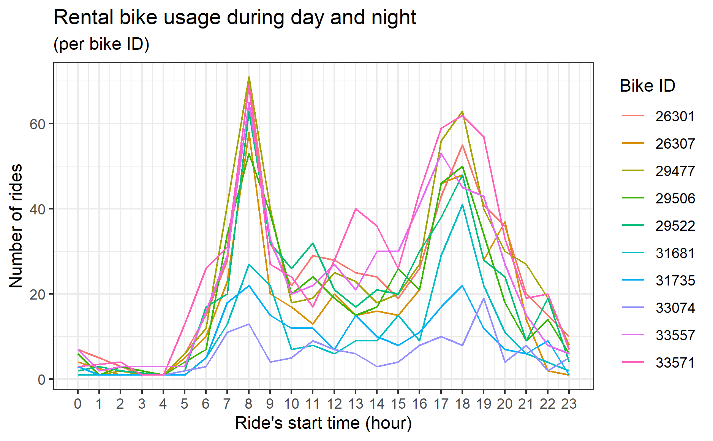
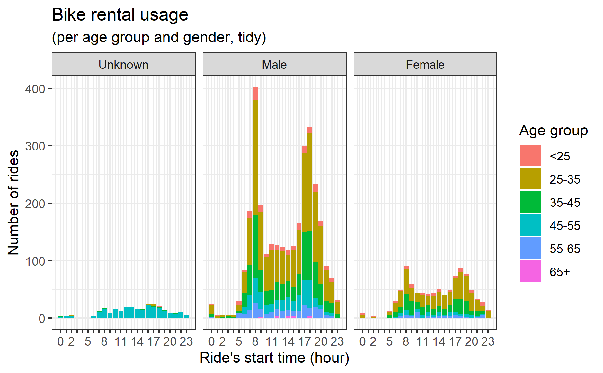

```{r setup, include=FALSE}
knitr::opts_chunk$set(echo = FALSE, warning = FALSE, message = FALSE)
```

```{r}
library(tsibbledata)
library(tsibble)
library(feasts)
library(lubridate)
library(magrittr)
library(scales)
library(dplyr)
library(wesanderson)
library(sf)
library(shiny)
library(leaflet)
library(widgetframe)
nyc_bikes_df <- nyc_bikes
```

## Bike circulation and seasonal usage

Firstly, let's look at the rental bikes usage in 2018.<br> {width="66%"} <br> From here, we can see that the
usage is lower during winter months. To find the reasons of it, let's
look at the monthly usage of each of 10 availiable bikes.<br>

{width="66%"} <br>From this visualisation,
we can see that it is true that the usage of each separate bike is lower
during winter months (probably due to weather conditions, as winters in
New York may be icy and snowy). However, we also see that not all 10
bikes were in circulation during full year (maybe they were broken or
stolen or lost in another way). Let's see how many bikes our of our
10-bike sample were in circulation in each month.<br>

{width="66%"} <br> Now, we can see that
lower usage in winter months is explained not only by weather, but also
by lower number of bikes. Unfortunately, we can only guess why some
bikes disappeared from circulation. It requires an additional targeted
research. <br>

## Timetables

Let's have a look on bike usage over day and night. For this part of
research, we are going to use all the availiable data (including the
1969 peak data).<br> {width="80%"}<br>
When we look at the same data by gender, we see that the tendency to use
rental bikes at the beginning and at the end of the day is the same for
all genders.<br> {width="80%"}<br> <br>

## Demographics

Let's look at the age of our customers<br>

{width="80%"}<br> We can see an abnormal
spike of customers with unknown gender born in 1969. Also, we can see
some people older than 100 years. For the demographic research, we are
going to filter the data: take into account only people born after 1940,
and also remove everyone born in 1969 with unwkown gender.<br> <br>

{width="80%"}<br>

We can see that the majority of our customers are between 25 and 45
years old, and the majority are men. Let's see at what time of the day
(or night) they use the bikes (for simplisity, let's divide them into
age groups. <br>

{width="80%"}

<br> Here, we can clearly see two interesting things:<br> 1. Women
aren't keen to use rental bikes during night hours.<br> 2. The 65+ age
group also prefer using the bikes only during daytime, and also they are
mostly men. <br><br> Assumption: safety issues in both scenario?<br>

## Location
<br>
Locations of the bikes at 8am.<br>

```{r}
nyc_bikes_df_tidy_starts <- nyc_bikes_df %>% 
  mutate(
    start_year = year(start_time),
    start_month = month(start_time, label = TRUE, abbr = TRUE), 
    start_day = day(start_time), 
    start_weekday = wday(start_time, label = TRUE, abbr = TRUE),
    start_hour = hour(start_time),
    .after="start_time"
    )

nyc_bikes_df_tidy_starts_ends <- nyc_bikes_df_tidy_starts %>% 
  mutate(
    end_year = year(stop_time),
    end_month = month(stop_time, label = TRUE, abbr = TRUE), 
    end_day = day(stop_time), 
    end_weekday = wday(stop_time, label = TRUE, abbr = TRUE),
    end_hour = hour(stop_time),
    .after="stop_time"
    )


nyc_bikes_df_tidy_starts_ends %>% 
  filter(start_hour == 8) %>% 
leaflet() %>%
  addTiles() %>%
  addCircleMarkers(lng = ~start_long,
                   lat = ~start_lat)
```
<br>
Locations of the bikes at 6pm.<br>

```{r}

nyc_bikes_df_tidy_starts_ends %>% 
  filter(end_hour == 18) %>% 
leaflet() %>%
  addTiles() %>%
  addCircleMarkers(lng = ~start_long,
                   lat = ~start_lat)
```


## Conclusions: recommended further research

1. The reason for the drop of usage in winter months is not only less rentals, but also fewer bikes. It is difficult to make conslusions about the bikes' life-cycle on the sample of 10 bikes and 12 months rental data, but there is a clear possibility for further research.
<br>
2. Women, as well as older people, not only use rental bikes less often, but also rarely use them during night hours. It is a possible highlight of some safely issues. If it is true, then it is a reputation disadvantage out of the brand's control, however it may be mitigated with a careful marketing campaign. 
it is a possible reputation disadvantage, and  <br>
3. Judging by the timing, the majority of clients (both subscribers and one-time customers) use rental bikes for their daily commute to and from work. So this is probably a reputation point that may be used in future marketing campaigns.


